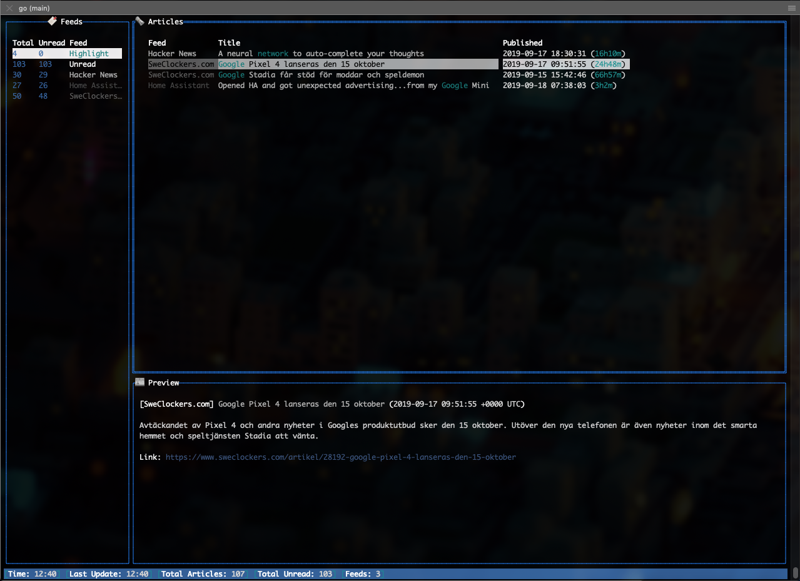

# GORSS - Go RSS Reader
[](https://goreportcard.com/report/github.com/lallassu/gorss)
[](http://www.opensource.org/licenses/MIT)

## About
Simple RSS/Atom reader written in Golang. Highly configurable and with themes.


[Screenshots](#screenshots)


## Usage
Tarballs with prebuilt binaries for both Linux and OSX can be found under release page.

Just start by running either `gorss_linux` or `gorss_osx` binary from the tarballs.

You can also specify theme, configuration and database manually.
```
./gorss -config gorss.conf -theme default.theme -db mydb.db
```

If either the configuration or theme files are not specified, gorss will attempt
to use`$XDG_CONFIG_HOME/gorss/gorss.conf` and
`$XDG_CONFIG_HOME/gorss/themes/default.theme`, respectively.  These files will be
created from the defaults if not present.

To build and run use the makefile.
```
make run
```

In order to cross-compile `make release` for Linux on OSX you need to install the following:
```
brew install FiloSottile/musl-cross/musl-cross
```

The database `gorss.db` will be automatically created in your systems 'Data Home' directory. You can specify which database
to use with the argument `-db` to the binary.

## Features
- OPML Support for loading feed URLs (`opmlFile` in gorss.conf)
- Support for XDG configuration
- RSS and Atom support (via github.com/mmcdole/gofeed)
- Highlights for configurable words
- Keyboard shortcuts highly configurable
- Custom keys for custom execution of external applications
- Open links in browser
- Mark articles and open all marked in bulk in webbrowser
- Theme support
- Preview content of the RSS
- Backed by SQLite database
- Mark articles as read
- Mark all as read/unread
- Undo last read (mark it as unread)
- Search titles

## Configuration Example (Default config)
It's possible to specify configuration file as a flag, default is `gorss.conf`.

The configuration file can specify URLs of feeds as strings, or, if you want to
customise the name of the feed as it is shown in your Gorss, as objects with url
and name fields. (See the example below for supported options).
```
./gorss -config my.conf
```

```
{
    "highlights": [
        "emulation",
        "truck",
        "google",
        "network",
        "math",
        "toyota"
    ],
    "OPMLFile": "../example_ompl.xml",
    "feeds": [
        "https://news.ycombinator.com/rss",
        {"url": "https://www.sweclockers.com/feeds/nyheter", "name": "Swedish Overclocking"},
        {"url": "https://www.reddit.com/r/homeassistant/.rss", "name": "Home Assistant"},
        {"url": "https://www.reddit.com/r/golang/.rss"},
        {"url": "https://www.reddit.com/r/programming/.rss"}
    ],
    "feedWindowSizeRatio": 2,
    "articlePreviewWindowSizeRatio": 5,
    "articleWindowSizeRatio": 2,
    "previewWindowSizeRatio": 1,
    "daysToKeepDeletedArticlesInDB": 1,
    "daysToKeepReadArticlesInDB": 1,
    "skipArticlesOlderThanDays": 10,
    "secondsBetweenUpdates": 300,
    "skipPreviewInTab": true,
    "keyOpenLink": "Backspace2",
    "keyMarkLink": "Enter",
    "keyOpenMarked": "o",
    "keyDeleteArticle": "d",
    "keyMoveDown": "s",
    "keyMoveUp": "w",
    "keySortByDate": "r",
    "keySortByUnread": "e",
    "keySortByTitle": "t",
    "keySortByFeed": "y",
    "keyUpdateFeeds": "Ctrl+U",
    "keyMarkAllRead": "Ctrl+R",
    "keyMarkAllUnread": "Ctrl+T",
    "keyTogglePreview": "q",
    "keySelectFeedWindow": "1",
    "keySelectArticleWindow": "2",
    "keySelectPreviewWindow": "3",
    "keyToggleHelp": "h",
    "keySwitchWindows": "Tab",
    "keyQuit": "Esc",
    "keyUndoLastRead": "u",
    "keySearchPromt": "/",
    "customCommands": [
        { 
            "key": "j",
            "Cmd": "echo 'ARTICLE.Content' 'ARTICLE.Link' > /tmp/test2.txt"
        },
        { 
            "key": "k",
            "Cmd": "echo 'ARTICLE.Title' 'ARTICLE.Feed' > /tmp/test.txt"
        }
    ]
}
```

## Custom Commands
Custom commands can be added such as the example in the example configuration above.

The variables given will be substituted with the content of the given article. There are no escaping going on
so be careful!

Available variables are:
* `ARTICLE.Content` - The content of the article
* `ARTICLE.Link` - The link to the article
* `ARTICLE.Feed` - Name of the feed
* `ARTICLE.Title` - Title of the article

## Themes
Themes are highly configurable and 3 example themes are included. You can start gorss with a specific theme as argument.
```
./gorss -theme my.theme
```

Themes are configured with JSON, default example below:
```
{
    "feedNames": [
        "#8ed2c8",
        "#46aa9f",
        "#2e6294",
        "#3b9293"
    ],
    "date": "#a25478",
    "time": "#f96bad",
    "articleBorder": "#4b7d81",
    "previewBorder": "#4b7d81",
    "feedBorder": "#4b7d81",
    "feedBorderTitle": "#fcedd5",
    "articleBorderTitle": "#fcedd5",
    "previewBorderTitle": "#fcedd5",
    "highlights": "#c90036",
    "tableHead": "#b2b37d",
    "title": "#fcedd5",
    "unreadFeedName": "#FFFFFF",
    "totalColumn": "#FFFFFF",
    "unreadColumn": "#FFFFFF",
    "previewText": "#FFFFFF",
    "previewLink": "#39537e",
    "statusBackground": "#4b7d81",
    "statusText": "#fcedd5",
    "statusKey": "#f6d270",
    "statusBrackets": "#bfceab",
    "feedIcon": "🔖",
    "articleIcon": "🗞",
    "previewIcon": "📰",
    "linkMarker": "🌍",
    "unreadMarker": "🌟"
}
```

## [Screenshots]




## License
This is distributed under the [MIT License](http://www.opensource.org/licenses/MIT).

